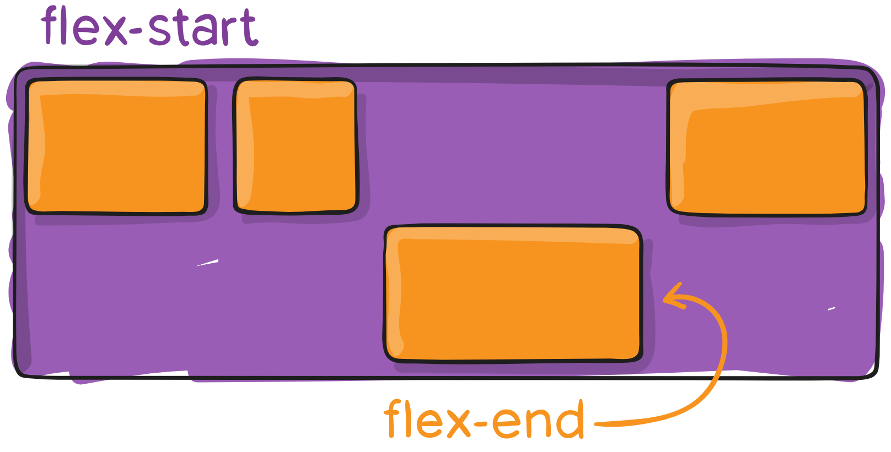

# СПРАВОЧНИК ПО FLEX-BOX

**display: flex** == задает всем детям flex, т.е. определяет flex контейнер{

**flex-direction** == определяет какая ось будет главной, т.е. определяет 	точку отсчета
 **row** == значение по умолчанию, элемнты идут слева направо, 	как бы в строчку
 **row-reverse** == в строчку, только справа налево
 **column** == друг под другом, "в столбик", как _display: block_
 **column-reverse** == как column, только первый элемент 	окажется снизу
  
}

**flex-wrap** == определяет, будут ли элементы переноситься на другую 	строку{

 **nowrap** == значение по умолчанию, элементы не переносятся
 **wrap** == элементы могут перескочить на другую строку, 	обчно - вниз
 **wrap-reverse** == теперь элементы переносятся на верхнюю 	строку
 
}

**flex-flow** == применяется к родительскому элементу (контейнеру) и 	определяет порядок расположения дочерних элементов внутри родительского контейнера, является сокращением для *flex-direction* и *flex-wrap* и объединяет оба эти свойства{

 **flex-flow: row nowrap** == значение по умолчанию
}

**justify-content** == определяет выравнивание вдоль главной оси (я называю - распределяет){

 **flex-start** == элементы сдвинуты к *началу* *flex-direction* направления
 **flex-end** == элементы сдвинуты к *концу* *flex-direction* направления
 **start** == элементы сдвинуты к началу *writing-mode* направления. _**(видимо началу строки, наверное для разных языков)**_
 **end** == противоположность *start*
 **left** == элементы сдвинуты по направлению к левому краю контейнера,если это не имеет смысла **flex-direction**, тогда ведет себя как *start* _**что это значит - не знаю**_
 **right** == элементы сдвинуты к правому краю контейнера, если это не имеет смысла **flex-direction**, тогда ведет себя как *start* _**что это значит - не знаю**_
 **center** == элементы ЦЕНТРИРОВАНЫ ...вдоль линии
 **space-between** == элементы равномерно распределены от края до края контейнера
 **space-around** == элементы распределены по линии, но отступы **вокруг каждого эленета равны!**
 **space-evenly** == элементы распределены равномерно по линии и имеют **равные** отступы друг от друга и краев страницы
 **right ... + safe | unsafe** == *(описание с сайта)* Использование *safe* гарантирует, что как бы вы ни занимались этим типом позиционирования, вы не сможете расположить элемент таким образом, чтобы он отображался за пределами экрана (например, сверху) так, чтобы содержимое тоже не могло быть прокручено (это называется «потеря данных»)

}

**align-items** == свойство,которое определяет, как элементы будут расположены вдоль **поперечной**, иначе - ВЕРТИКАЛЬНОЙ (если их не меняли местами) оси{

 **stretch** == значение по умолчанию, растягивает вдоль оси, чтобы заполнить контеййнер (значения *min|max-width* все еще сохраняются)
 **flex-start | start | self-start** == элементы располагаются **в начале** поперечной оси (по умолчанию - прилипнут кверху)
 **flex-end | end | self-end** == элементы располагаются **в конце** поперечной оси
 *примечание к предыдущим двум свойствам с сайта "Разница между ними невелика и заключается в соблюдении flex-direction правил или writing-mode правил"*
 **center** == элементы центрированы по поперечной оси
 **baseline** == элементы выровнены по их базовой линии
 (*safe и unsafe ключевые слова модификаторов могут быть использованы в сочетании со всеми из этих ключевых слов (хотя это поддерживается не всеми браузерами), это помогает предотвратить выравнивание элементов таким образом, что содержание становится недоступным*)
 
}

**align-content** == выравнивает линии (строки) из дочерних элементов в пределах контейнера, когда есть свободное пространство на **поперечной оси**. можно провести аналогию с *justify-content*{

 **flex-start | start** == элементы сдвинуты в начало контейнера, 
 **flex-end** == элементы сдвинуты в конец контейнера
 (*Более поддерживаемый flex-start | flex-end использует, flex-direction в то время как start использует writing-mode направление.*)
 **center** == элементы в контейнере выровнены по центру
 **space-between** == элементы распределены в контейнере равномерно, первая строка - в начале контейнера, последняя - в конце
 **space-around** == элементы распределены равномерно, с **равным** пространством вокруг каждой строки
 **space-evenly** == элементы распределены равномерно, вокруг них одинаковое пространство
 **stretch** == значение по умолчанию, линии растягиваются, чтобы занять все доступное пространство
 (*safe и unsafe ключевые слова модификаторов могут быть использованы в сочетании со всеми из этих ключевых слов (хотя это поддерживается не всеми браузерами), это помогает предотвратить выравнивание элементов таким образом, что содержание становится недоступным*)
 
}

## Свойства для первых дочерних элементов

**flex-grow** == определяет способность элемента растягиваться в случае необходимости (*тут имеется в виду, что элемент(ы), у которых такое свойство прописано будут расширяться несколько больше других*){

 **flex-grow: <number>** == где number = любое, **кроме отрицательного!** числовое значение
  
}

**flex-shrink** == определяет способность гибкого элемента сжиматься (*а тут наоборот - некоторый элемент(ы) будут отбражаться **уже** других*){

 **flex-shrink: <number>** == где number = любое, **кроме отрицательного!** числовое значение
}

**flex-basis** == свойство определяет размер элемента по умолчанию перед распределением оставшегося пространства. Это может быть длина или ключевое слово (20%, 5rem, auto, content){

 **flex-basis: <length> | auto** *Если установлено значение 0, дополнительное пространство вокруг содержимого не учитывается. Если установлено значение auto, дополнительное пространство распределяется в зависимости от его flex-grow значения*
}

**flex** == сокращение для использования *flex-grow*, *flex-shrink* и *flex-basis* вместе. *Второй и третий параметры (flex-shrink и flex-basis) являются необязательными. По умолчанию это 0 1 auto*{

 **flex: none | [ <'flex-grow'> <'flex-shrink'>? || <'flex-basis'> ]**
}

**align-self** == свойство позволяет переопределить выравнивание по умолчанию (или указанное с помощью align-items) **!!!для отдельных элементов flex!!!**{

 **align-self: auto | flex-start | flex-end | center | baseline | stretch**
 
}
